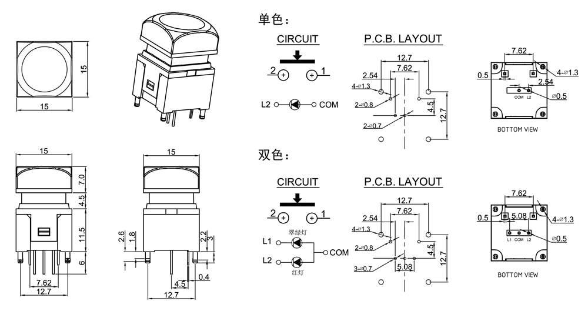
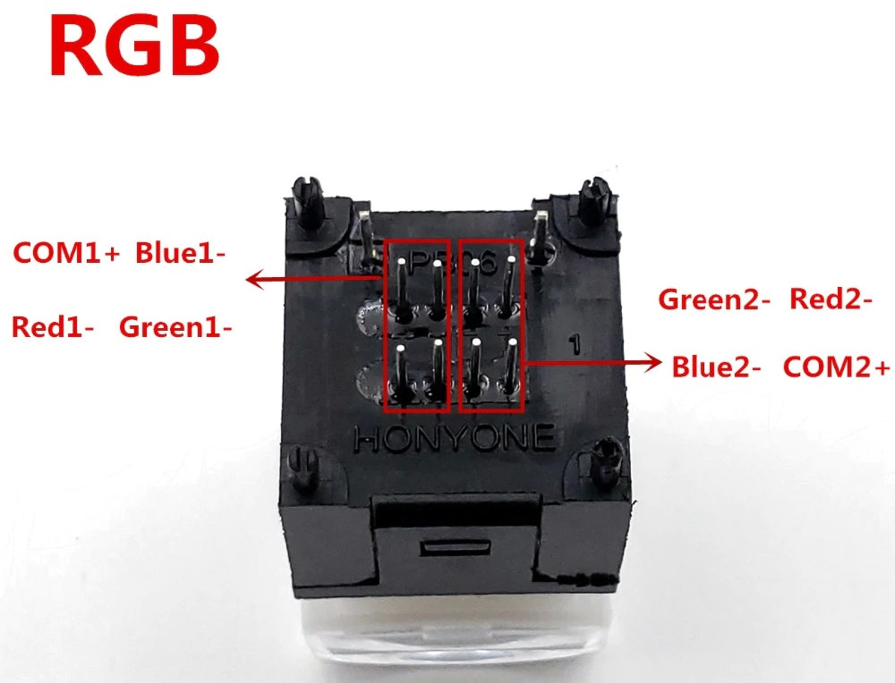
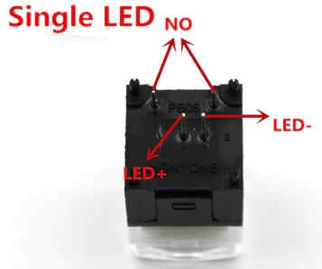
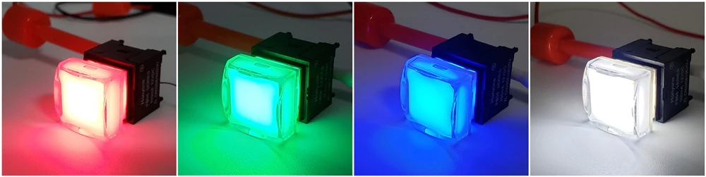
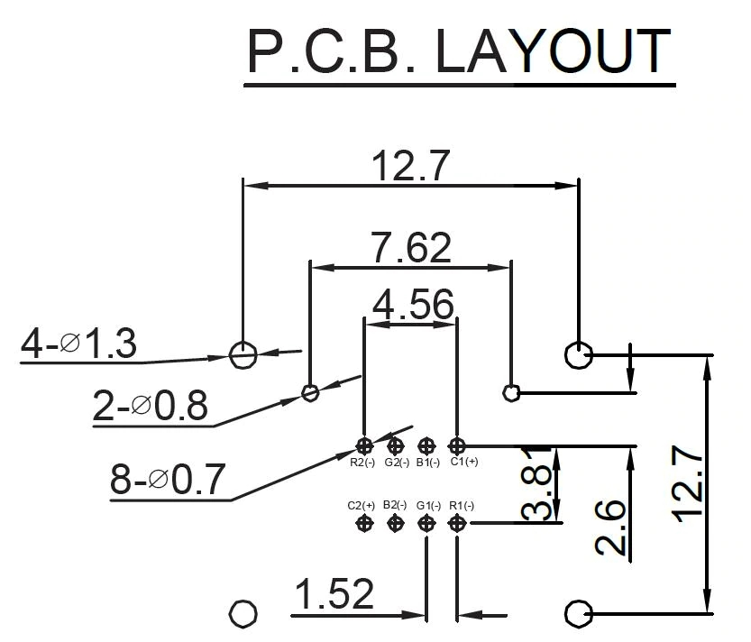
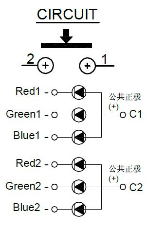
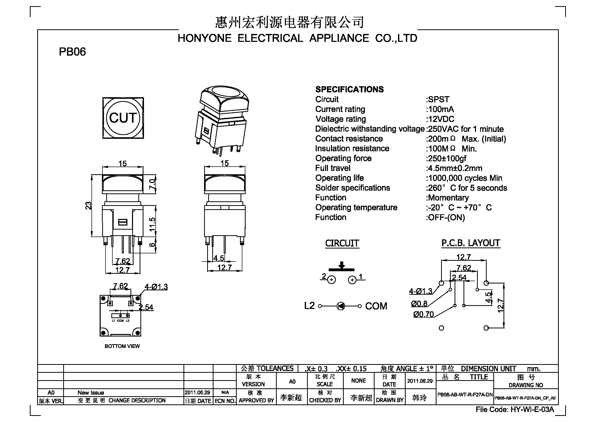
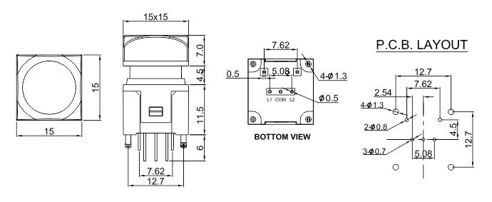

# Honyone LED PB06-B-WT
## Inhaltsverzeichnis
1. [x] [Inhaltsverzeichnis](#Inhaltsverzeichnis)
1. [ ] [Beschreibung](#Beschreibung)
1. [ ] [Hardware](#Hardware)
   1. [ ] [Technische Daten](#technische-daten)
   1. [ ] [Datasheet](#datasheet)
   1. [ ] [PCB](#PCB)
1. [ ] [Software](#Software)
1. [ ] [3D](#3D)
1. [ ] [Where to buy](#Where-to-buy)
1. [ ] [Abbildungen](#Abbildungen)
1. [x] [Credits](#Credits)

## Beschreibung
LED-Switch (white, red(pink), green, blue, RGB)

## Hardware
[Honyone-Website](http://www.honyone.com/en/products/show_243.html)
### Technische Daten
* Model: PB-06-B-WT1
   * PB06-B-WT-R-NN-DY (Red)
   * PB06-B-WT-G-NN-DY (Green)
   * PB06-B-WT-U-NN-DY (Blue)
   * PB06-B-WT-W-NN-DY (White)
   * PB06-B-WT-RGB-NN-QY (RGB)
* Function: Momentary
* Circuit: OFF-(ON) / Momentary SPST
* Current Rating: 100mA
* Solder Spec: 350 °C for 5 seconds
* Resistance: 100 MOhm
* Operating life: 1.000.000 Cycles minimum
* LCSC Part #: Honyone-products not available
* EAN / GTIN: not available

### Datasheet
* 
* 
* 
### PCB
## Software
## 3D

## Where to buy
~ 19 EUR for 10pcs: [AliExpress JC Electronic Components](https://www.aliexpress.com/item/33004443562.html)

## Abbildungen

## Credits
* :+1: [arduino](https://github.com/arduino)
* :+1: [adafruit](https://github.com/adafruit)
* :+1: [sparkfun](https://github.com/sparkfun)
* :+1: [Watterott](https://github.com/watterott) and @awatterott for great SW, HW and products
* :+1: [atom](https://github.com/atom)
* :+1: [mattahan](https://www.deviantart.com/mattahan) for the [Buuf graphics](https://www.deviantart.com/mattahan/art/Buuf-37966044)
* :+1: @ikatyang for the [emoji-cheat-sheet](https://github.com/ikatyang/emoji-cheat-sheet/blob/master/README.md)
